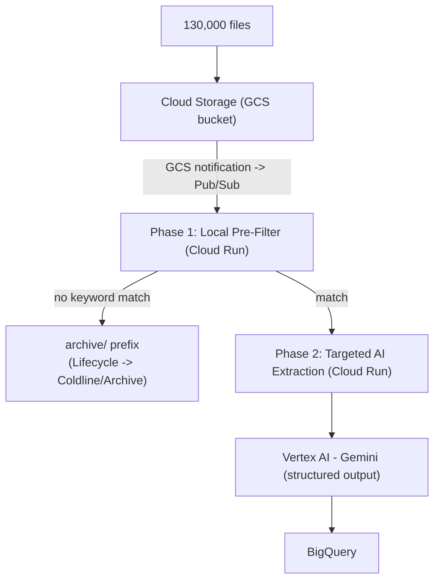

# Switchgear Document Extraction Pipeline (GCP)

Cost-effective pipeline to pull structured switchgear/switchboard spec data out of
~130,000 mixed-format files (`.doc`, `.docx`, `.pdf`, `.xls`, `.xlsx`, `.xlsm`).

## Core principle: funnel architecture

Never run GCP's managed AI/OCR APIs on all 130k raw files. Filter locally with cheap
serverless compute first, and only spend generative-AI tokens on the documents that
actually mention switchgear.



### Phase 1 — Local pre-filtering (`pipeline/phase1_filter`)

Triggered by a GCS `OBJECT_FINALIZE` notification delivered via Pub/Sub push to a
Cloud Run service.

- Extracts raw text locally, no cloud AI calls:
  - PDF: PyMuPDF (`fitz`)
  - `.docx`: `python-docx`
  - `.doc` (legacy binary): LibreOffice headless conversion (`soffice --convert-to docx`) — pure-Python libraries don't parse the old binary format
  - `.xlsx` / `.xlsm`: `openpyxl`
  - `.xls` (legacy): `xlrd` (only reads `.xls`; it dropped `.xlsx` support in 2.0)
- Scanned PDFs with no text layer fall back to local OCR (`pdf2image` + `pytesseract`)
  before being written off as unreadable.
- Regex/keyword match against: `switchboard`, `switch board`, `skid`, `skids`
  (case-insensitive, word-boundary).
- **No match** → object is copied under `archive/` in the same bucket. A lifecycle
  rule scoped to that prefix transitions it to Coldline/Archive storage.
- **Match** → full extracted text is written to `extracted/<path>.txt` in GCS, and a
  Pub/Sub message (GCS path + object metadata) is published to the Phase 2 topic.

### Phase 2 — Targeted AI extraction (`pipeline/phase2_extract`)

Triggered by the Phase 2 Pub/Sub push subscription — only for documents that passed
the Phase 1 filter, so token spend tracks matches, not the full 130k corpus.

- Reads the extracted text from GCS, truncates to a bounded chunk (~2,000 tokens)
  rather than sending whole multi-hundred-page dumps.
- Calls Vertex AI Gemini with a JSON response schema (structured output) — no
  Document AI custom extractor, which runs $20–30 per 1,000 pages.
- Scanned-image fallback: Cloud Vision `TEXT_DETECTION` (~$1.50 / 1,000 pages) feeds
  its output into the same Gemini extraction step.
- Writes the resulting row to BigQuery (`bigquery_schema.json`).

> **Model note:** the original spec named "Gemini 1.5 Flash." Gemini 1.5 models are
> retired on Vertex AI as of this writing, so the scaffold defaults to
> `gemini-2.5-flash` instead (same cost tier, current generation). The model id is a
> single constant (`GEMINI_MODEL` in `pipeline/phase2_extract/main.py`, overridable via
> the `GEMINI_MODEL` env var) — swap it if you want a different Gemini model.

### Extracted fields

```json
{
  "component": "ABC",
  "Product": "ABC 123",
  "Vendor": "ABC",
  "Ampacity": "800A",
  "Voltage": "110V",
  "Enclosure type": "NEMA3R",
  "Options": "Thermostat",
  "Circuit Breaker Details": "LCB 1 Right",
  "Total Price": "$10000"
}
```

See `pipeline/phase2_extract/schema.py` for the JSON schema and prompt template, and
`bigquery_schema.json` for the destination table shape.

## Repo layout

```
infra/                  gcloud setup script + BigQuery table schema
pipeline/phase1_filter/ Cloud Run service: parse + regex filter
pipeline/phase2_extract/Cloud Run service: Gemini structured extraction -> BigQuery
scripts/local_test.py   run Phase 1 parsing/matching against local files, no GCP needed
```

## Local testing (no GCP required)

```bash
pip install -r pipeline/phase1_filter/requirements.txt
python scripts/local_test.py /path/to/some/file.pdf
```

This runs the same parser + regex logic Phase 1 uses in Cloud Run and prints
match/no-match plus the extracted text, so you can validate the keyword logic against
real files before deploying anything.

## Deploying

`infra/setup.sh` is a reference script (edit the variables at the top, then run
section by section) that:

1. Creates the GCS bucket and the `archive/`-scoped lifecycle rule.
2. Creates the two Pub/Sub topics (`phase1-trigger`, `phase2-trigger`) and the GCS
   notification that feeds `phase1-trigger`.
3. Creates the BigQuery dataset/table from `bigquery_schema.json`.
4. Builds and deploys both Cloud Run services, and wires up their push subscriptions.

It is not meant to be run unattended — review the project ID, region, and bucket
name first.
